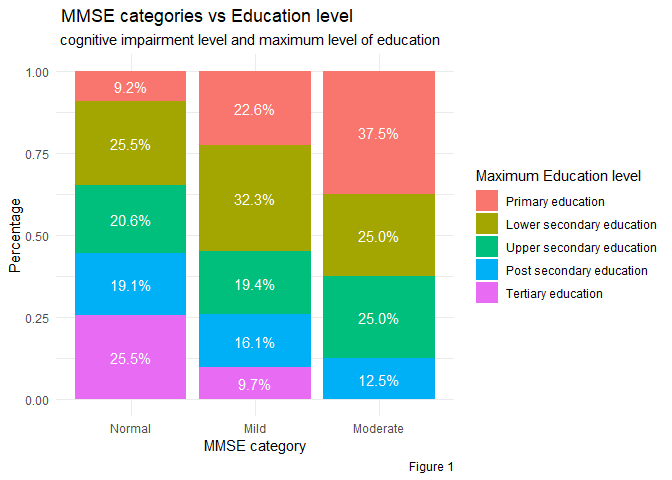
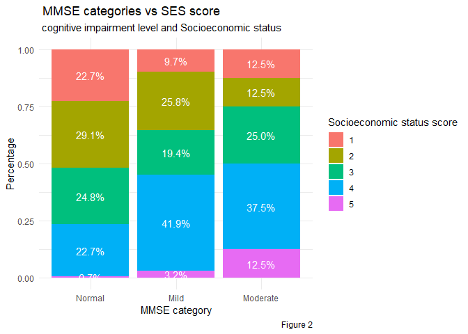
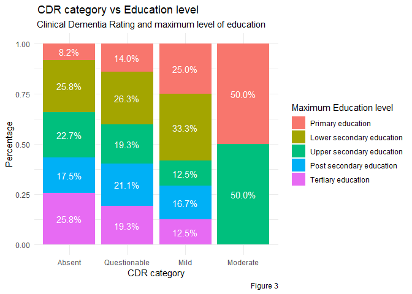
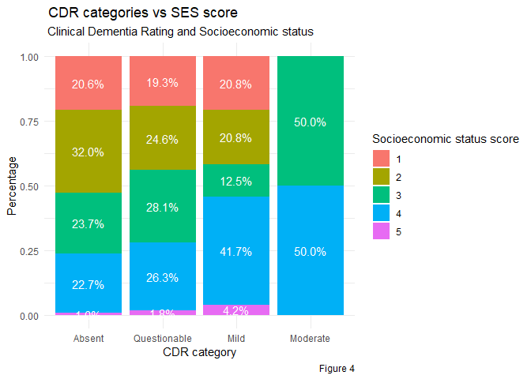
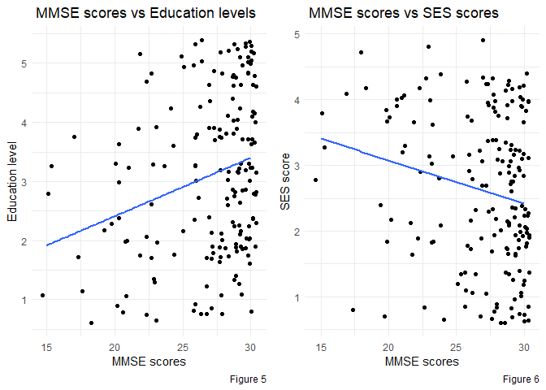
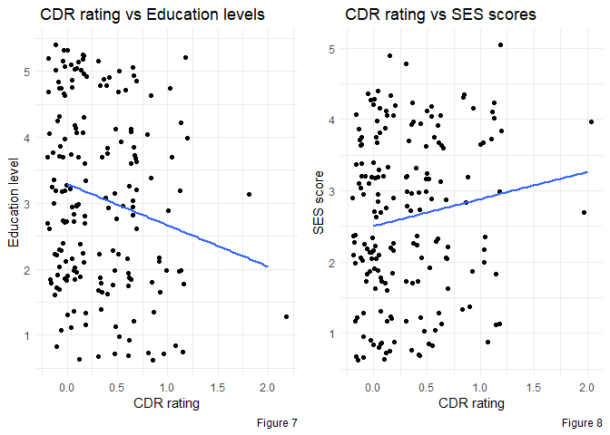

Alzheimer’s disease and Socioeconomic factors
================
Daniyal Imran Aleem
28/7/2023

# Introduction

In this case study an analysis was carried out on a data set consisting
of Alzheimer’s patients along with healthy controls. This data set was
published on Kaggle by [Jacob
Boysen](https://www.kaggle.com/datasets/jboysen/mri-and-alzheimers?datasetId=1980&language=R)
and consists of a series of Open Access imaging studies on MRI as well
as metrics for each patient involved. These metrics include aspects such
as Age, gender, Education level, Socioeconomic status, MMSE, CDR etc.
For the the purpose of this case study we will be analyzing
Socioeconomic status and Education level along with disease presence in
subjects above the age of 60. This will provide us insights into a
hypothesis of poorer socioeconomic status and education levels being
correlated with higher risks of Alzheimer’s disease.

## Research into Alzheimer’s and Socioeconomic status

Alzheimer’s disease is a progressive neurodegenerative condition that is
the most common cause of dementia, a general term for a decline in
cognitive abilities severe enough to interfere with daily life. Named
after Dr. Alois Alzheimer who first described it in 1906, the disease is
characterized by symptoms like memory loss, difficulties with
problem-solving or language, confusion about time and place, and changes
in mood and behavior. Alzheimer’s disease primarily affects individuals
over the age of 65, and the risk increases as one gets older. In recent
years diseases like Alzheimer’s have been on the rise. This rise can be
attributed to rising life expectancy around the world. With the world
average lifespan increasing, the prevalence of geriatric neurological
diseases also increases. Alzheimer’s has a plethora of risk factors.
This includes things like lifestyle choices and diet. The disease is
seen to effect induviduals with poor diet, exercise and sedentary
lifestyles earlier than those without. Research also dictates education
and socioeconomic status as a part of risk factors for the disease.
Socioeconomic status includes aspects of an individual such as education
level, income, and family income. It provides an idea into how well off
an individual might be.
[Studies](https://academic.oup.com/aje/article/159/2/175/166359?login=false)
have indicated that lower levels of education and socioeconomic status
are linked to an increased risk of developing Alzheimer’s disease,
although the reasons behind this relationship are complex and
multifaceted. Socioeconomic status impacts a variety of factors that
influence Alzheimer’s risk. Lower socioeconomic status often means
limited access to quality healthcare, healthy nutrition, and
opportunities for mental stimulation, all of which can increase the risk
of Alzheimer’s. Stress is another key factor - lower socioeconomic
status is often associated with higher levels of stress, which has been
linked to an increased risk of Alzheimer’s. Using this hypothesis as our
basis of assessing Alzheimer’s risk factors, this case study will use
the jacob boysen dataset and attempt to find correlations between lower
levels of education and socioeconomic factors with higher prevalences of
Alzheimer’s.


## Main goals of this case study

- Provide insights into correlations or lack of correlation between
  Socioeconomic status and Alzheimer’s disease in patients above the age
  of 60

- Provide insights into correlations or lack of correlation between
  Education level and Alzheimer’s disease in patients above the age of
  60

- Provide an in depth analysis and reasoning for the results

- Provide the limitations of the case study and alternatives

## Defining variables

#### The dataset contains a total of 10 different attributes (Columns)

##### 1. ID

##### 2. M/F

##### 3. Dominant hand

##### 4. Age in years

##### 5. Education level

- Education level is denoted on a scale from 1-5. Each number represents
  an education level eg. primary, secondary,lower secondary, upper
  secondary, post secondary, and tertiary

##### 6. Socioeconomic status

- SES or socioeconomic status is denoted on a scale of 1-5 with 5 being
  the highest socioeconomic status and 1 being the lowest.

##### 7. MMSE (mini mental state examination)

- MMSE is a tool used in measuring cognitive impairment. It is a test
  out of 30 where 30 means healthy and 0 means high levels of cognitive
  impairment.

##### 8. Clinical dementia rating (CDR)

- CDR is a clinical rating for dementia patients. It is rated from 0-5
  with 0 being Dementia absent and 5 being terminal.

##### 9. Estimated Total Intracranial Volume

##### 10. Normalize Whole Brain Volume

# Methods

1.  **Preliminary analysis**: Using SQL and Google sheets to perform
    preliminary analysis. Looking at the data overall and what columns
    we are working with. Validating that the data is free of errors and
    ready for cleaning

2.  **Data cleaning**: Selecting relevant columns, filtering for ages
    above 60, removing nulls, and making sure the data is free of errors

3.  **Data Analysis**

    - Creating new columns with categories that reflect ranges of data
    - Performing explanatory analysis by looking at counts of different
      columns, averages, and creating tables that show healthy vs
      diseased patients.
    - Making bar graphs showing percentage abundances of each category
    - Making jitterplots to better understand trends
    - Using a spearman’s rank correlation coefficient to validate any
      correlation

4.  **Results**: stating what results were achieved with the analysis.  

5.  **Discussion**: Explaining the results as well as what limitations
    were present in the study.

# Data Cleaning process

## Preliminary Analysis

- A preliminary analysis was initially carried out with Google sheets
  and SQL. This preliminary analysis provided insights on the data
  cleaning process. Null values were removed and any errors in the data
  set were adressed and corrected. SQL provided insights into the data
  as a whole and highlighted aspects such as maximum, minimum, and
  average values for the different columns. Using this explanatory
  preliminary analysis allowed for a better understanding of the data
  being studied and what sort of upper and lower bounds we were dealing
  with. After this Columns were filtered and only columns required for
  the purpose of the case study were utilized. These include ID, Gender,
  Age, Education, SES, MMSE, and CDR. 7 out out of the original 10
  columns remain.After the preliminary analysis and cleaning only 216
  observations remained out of the initial 436.

### SQL code used for preliminary analysis

    SELECT
     (ID,M_F,Age,Educ,SES, MMSE, CDR)
    FROM arboreal-moment-390009.Alzheimers.Alzheimers
    WHERE SES is not NULL  

- Once our preliminary analysis was complete we loaded our dataset into
  R and began cleaning.

### Installing Packages

### Loading packages

``` r
library(ggplot2)
library(dplyr)
library(broom)
library(tidyverse)
library(ggpubr)
library(readr)
library(rmarkdown)
library(knitr)
library(cowplot)
library(tinytex)
```

### Loading data

``` r
data <- read_csv("oasis_cross-sectional.csv")
```

    ## Rows: 436 Columns: 12
    ## ── Column specification ────────────────────────────────────────────────────────
    ## Delimiter: ","
    ## chr (4): ID, M/F, Hand, Delay
    ## dbl (8): Age, Educ, SES, MMSE, CDR, eTIV, nWBV, ASF
    ## 
    ## ℹ Use `spec()` to retrieve the full column specification for this data.
    ## ℹ Specify the column types or set `show_col_types = FALSE` to quiet this message.

``` r
colnames(data)[2] = "M.F"
```

## Filtering and selecting data

For the purpose of this study our clean data should include records
above the age of 60 as well as remove any nulls and have the data
arranged by age in ascending order.

``` r
## Selecting the relevant columns and filtering for patients above the age of 60.

data_clean<-data %>% 
  select(ID, M.F, Age, Educ, SES, MMSE, CDR) %>% 
  filter(Age>= 60) %>% 
##Arranging in ascending order and removing any remaining NULLS
  na.omit(SES) %>% 
  arrange(Age)

## Taking a look at our cleaned data.
glimpse(data_clean)
```

    ## Rows: 180
    ## Columns: 7
    ## $ ID   <chr> "OAS1_0072_MR1", "OAS1_0200_MR1", "OAS1_0109_MR1", "OAS1_0455_MR1…
    ## $ M.F  <chr> "F", "F", "F", "F", "M", "M", "F", "F", "F", "M", "M", "F", "F", …
    ## $ Age  <dbl> 60, 60, 61, 61, 61, 62, 62, 63, 64, 64, 64, 64, 65, 65, 65, 65, 6…
    ## $ Educ <dbl> 5, 2, 4, 2, 5, 2, 3, 3, 3, 2, 5, 4, 2, 5, 3, 3, 1, 2, 2, 5, 3, 2,…
    ## $ SES  <dbl> 1, 4, 3, 4, 2, 4, 3, 2, 2, 4, 2, 2, 3, 2, 4, 3, 4, 3, 4, 2, 4, 4,…
    ## $ MMSE <dbl> 30, 30, 30, 28, 30, 30, 26, 30, 30, 29, 22, 30, 29, 30, 29, 29, 2…
    ## $ CDR  <dbl> 0.0, 0.0, 0.0, 0.0, 0.0, 0.0, 0.0, 0.0, 0.0, 0.0, 0.5, 0.0, 0.0, …

``` r
str(data_clean)
```

    ## tibble [180 × 7] (S3: tbl_df/tbl/data.frame)
    ##  $ ID  : chr [1:180] "OAS1_0072_MR1" "OAS1_0200_MR1" "OAS1_0109_MR1" "OAS1_0455_MR1" ...
    ##  $ M.F : chr [1:180] "F" "F" "F" "F" ...
    ##  $ Age : num [1:180] 60 60 61 61 61 62 62 63 64 64 ...
    ##  $ Educ: num [1:180] 5 2 4 2 5 2 3 3 3 2 ...
    ##  $ SES : num [1:180] 1 4 3 4 2 4 3 2 2 4 ...
    ##  $ MMSE: num [1:180] 30 30 30 28 30 30 26 30 30 29 ...
    ##  $ CDR : num [1:180] 0 0 0 0 0 0 0 0 0 0 ...
    ##  - attr(*, "na.action")= 'omit' Named int [1:18] 5 18 20 24 38 41 52 63 69 75 ...
    ##   ..- attr(*, "names")= chr [1:18] "5" "18" "20" "24" ...

- The above code filters the results to only show individuals above the
  age of 60 years old. This is important as our case study revolves only
  around patients above the age of 60. After this cleaning we have 180
  observations left from 216. The remaining observations are cleaned and
  will be used further for analysis.

# Data Analysis

#### Categorizing ranges

To provide us with a clearer picture during our analysis, we should
ideally have our data categorized according to medical definitions of
ranges regarding metrics such as MMSE and CDR. We will also categorize
education level.

We need to incorporate the following tables into our data

| MMSE range | Cognitive Impairment category |
|------------|-------------------------------|
| 25-30      | Normal                        |
| 20-24      | Mild                          |
| 15-19      | Moderate                      |
| 0-14       | Severe                        |

- *Table 1: MMSE ranges and categories*

| CDR rating | Dementia Category |
|------------|-------------------|
| 0          | Absent            |
| 0.5        | Questionable      |
| 1          | Mild              |
| 2          | Moderate          |
| 3          | Severe            |
| 4          | Profound          |
| 5          | Terminal          |

- *Table 2: CDR rating and categories*

| Education number | Education level |
|------------------|-----------------|
| 1                | Primary         |
| 2                | Lower secondary |
| 3                | Upper secondary |
| 4                | Post secondary  |
| 5                | Tertiary        |

- *Table 3: Education level (ISCED 2011)*

#### Creating labels

- As previously mentioned the MMSE and CDR variables are ranges that
  correlated to categories. In the first step of our analysis we give
  these ranges labels. This will allow for a better analysis later on
  when we start making graphs. We will also give education level labels.

``` r
data_final <- data_clean %>%
##Assigning labels for MMSE
  mutate(MMSE_category = case_when(
    MMSE >= 0 & MMSE <= 14 ~ "Severe",
    MMSE >= 15 & MMSE <= 19 ~ "Moderate",
    MMSE >= 20 & MMSE <= 24 ~ "Mild",
    MMSE >= 25 & MMSE <= 30 ~ "Normal",
    TRUE ~ "Other")) %>% 
## Assigning labels for CDR
  mutate(CDR_category = case_when(
    CDR == 0 ~ "Absent",
    CDR == 0.5 ~ "Questionable",
    CDR == 1 ~ "Mild",
    CDR == 2 ~ "Moderate",
    CDR == 3 ~ "Severe",
    CDR == 4 ~ "Profound",
    CDR == 5 ~ "Terminal",
    TRUE ~ "Other")) %>% 
## Assigning labels for Education levels
  mutate(edu_category = case_when(
    Educ == 1 ~ "Primary education",
    Educ == 2 ~ "Lower secondary education",
    Educ == 3 ~ "Upper secondary education",
    Educ == 4 ~ "Post secondary education",
    Educ == 5 ~ "Tertiary education",
    TRUE ~ "Other"))
```

- Our labels have been added and we can start performing exploratory
  analysis.

## Exploratory analysis

### Summary statistics

``` r
## Using the summary function for relevant columns 
summary_data<-summary(data_final[ c('Age', 'Educ', 'SES', 'MMSE', 'CDR')])

## Using kable to show the summary data in a table 
kable(summary_data, "pipe", col.names = c("Age", "Education level", "SES", "MMSE", "CDR"),allign = c("c", "c", "c", "c", "c"))
```

|     | Age          | Education level | SES           | MMSE         | CDR            |
|:----|:-------------|:----------------|:--------------|:-------------|:---------------|
|     | Min. :60.0   | Min. :1.000     | Min. :1.000   | Min. :15.0   | Min. :0.0000   |
|     | 1st Qu.:71.0 | 1st Qu.:2.000   | 1st Qu.:2.000 | 1st Qu.:26.0 | 1st Qu.:0.0000 |
|     | Median :76.5 | Median :3.000   | Median :3.000 | Median :28.0 | Median :0.0000 |
|     | Mean :76.7   | Mean :3.094     | Mean :2.622   | Mean :26.9   | Mean :0.3139   |
|     | 3rd Qu.:83.0 | 3rd Qu.:4.000   | 3rd Qu.:4.000 | 3rd Qu.:30.0 | 3rd Qu.:0.5000 |
|     | Max. :96.0   | Max. :5.000     | Max. :5.000   | Max. :30.0   | Max. :2.0000   |

- *Table 4 : a summary for numerical statistics being used in this case
  study*

#### Males vs females in the dataset

``` r
## Calculating statistics
percentage_female<-120/180 *100 
data_summary_stats<- data_final %>% 
  summarise(mean_age = mean(Age),
            ,Total = 180, female_count = 120, male_count = 60, percentage_female)

## Showing the statistics in a table
kable(data_summary_stats, "pipe", col.names = c("Mean age", "Total", "Number of females", "Number of males", "Percentage of females(%)"), allign = c("c","c","c","c"))
```

| Mean age | Total | Number of females | Number of males | Percentage of females(%) |
|---------:|------:|------------------:|----------------:|-------------------------:|
|     76.7 |   180 |               120 |              60 |                 66.66667 |

- *Table 5 : An overview of stats related to the participants in the
  data*

#### Healthy vs Alzheimer’s patients

``` r
## Calculating statistics
count_Alzheimers<- data_final %>% 
  filter(MMSE <= 24, CDR >= 0.5) %>% 
  nrow()
Percentage_Alzheimers<- (count_Alzheimers/180 *100)
summary_Alzheimers<- data_final %>% 
  summarise( mean_SES = mean(SES), mean_Educ = mean(Educ),
            count_Alzheimers, Percentage_Alzheimers)

## Showing the statistics in a table
kable(summary_Alzheimers, "pipe", col.names = c("Mean SES", "Mean Education", "Number of patients with Alzheimers", "Percentage of patients with Alzheimer's(%)"), allign = c("c", "c", "c", "c"))
```

| Mean SES | Mean Education | Number of patients with Alzheimers | Percentage of patients with Alzheimer’s(%) |
|---------:|---------------:|-----------------------------------:|-------------------------------------------:|
| 2.622222 |       3.094444 |                                 39 |                                   21.66667 |

- *Table 6 : An overview of healthy vs diseased patients*

## Graphical analysis

### MMSE categories and Education level

``` r
## Turning MMSE_category and edu_category into an ordered factor
data_final$MMSE_category<- factor(data_final$MMSE_category, levels = c("Normal", "Mild", "Moderate"))
data_final$edu_category<- factor(data_final$edu_category, levels = c("Primary education", "Lower secondary education", "Upper secondary education", "Post secondary education", "Tertiary education"))

## Making a count and percentage variable for the graph
percent_data<- data_final %>% 
  group_by(MMSE_category, edu_category) %>% 
  tally() %>% 
  mutate(percent = n/sum(n))

## Making the graph 
ggplot(percent_data, aes( x = MMSE_category, y = n, fill = edu_category))+
  geom_bar(stat = "identity", position = "fill")+
  geom_text(aes(label=paste0(sprintf("%1.1f", percent*100),"%")),
            position=position_fill(vjust=0.5), colour="white")+
  theme_minimal()+
  labs(title = " MMSE categories vs Education level")+
  labs(subtitle = " cognitive impairment level and maximum level of education")+
  labs(caption = "Figure 1")+
  labs(x = "MMSE category", y = "Percentage")+
  guides(fill=guide_legend(title="Maximum Education level"))
```

<!-- -->

### MMSE categories and SES scores

``` r
## Turning MMSE_category and SES into an ordered factor
data_final$MMSE_category<- factor(data_final$MMSE_category, levels = c("Normal", "Mild", "Moderate"))
data_final$SES<- factor(data_final$SES)

## Making a count and percentage variable for the graph
percent_data_SES<- data_final %>% 
  group_by(MMSE_category, SES) %>% 
  tally() %>% 
  mutate(percent = n/sum(n))

## Making the graph 
ggplot(percent_data_SES, aes( x = MMSE_category, y = n, fill = SES))+
  geom_bar(stat = "identity", position = "fill")+
  geom_text(aes(label=paste0(sprintf("%1.1f", percent*100),"%")),
            position=position_fill(vjust=0.5), colour="white")+
  theme_minimal()+
  labs(title = " MMSE categories vs SES score")+
  labs(subtitle = " cognitive impairment level and Socioeconomic status")+
  labs(caption = "Figure 2")+
  labs(x = "MMSE category", y = "Percentage")+
  guides(fill=guide_legend(title="Socioeconomic status score"))
```

<!-- -->

### CDR rating and Education categories

``` r
## Turning edu_category and CDR_category into an ordered factor
data_final$edu_category<- factor(data_final$edu_category, levels = c("Primary education", "Lower secondary education", "Upper secondary education", "Post secondary education", "Tertiary education"))
data_final$CDR_category<- factor(data_final$CDR_category, levels = c("Absent", "Questionable", "Mild", "Moderate"))

## Making a count and percentage variable for the graph
percent_data_CDR<- data_final %>% 
  group_by(CDR_category, edu_category) %>% 
  tally() %>% 
  mutate(percent = n/sum(n))

## Making the graph 
ggplot(percent_data_CDR, aes( x = CDR_category, y = n, fill = edu_category))+
  geom_bar(stat = "identity", position = "fill")+
  geom_text(aes(label=paste0(sprintf("%1.1f", percent*100),"%")),
            position=position_fill(vjust=0.5), colour="white")+
  theme_minimal()+
  labs(title = " CDR category vs Education level")+
  labs(subtitle = " Clinical Dementia Rating and maximum level of education")+
  labs(caption = "Figure 3")+
  labs(x = "CDR category", y = "Percentage")+
  guides(fill=guide_legend(title="Maximum Education level"))
```

<!-- -->

### CDR category and SES score

``` r
## Turning CDR_category and SES into an ordered factor
data_final$CDR_category<- factor(data_final$CDR_category, levels = c("Absent", "Questionable", "Mild", "Moderate"))
data_final$SES<- factor(data_final$SES)

## Making a count and percentage variable for the graph
percent_data_CDR_SES<- data_final %>% 
  group_by(CDR_category, SES) %>% 
  tally() %>% 
  mutate(percent = n/sum(n))

## Making the graph 
ggplot(percent_data_CDR_SES, aes( x = CDR_category, y = n, fill = SES))+
  geom_bar(stat = "identity", position = "fill")+
  geom_text(aes(label=paste0(sprintf("%1.1f", percent*100),"%")),
            position=position_fill(vjust=0.5), colour="white")+
  theme_minimal()+
  labs(title = " CDR categories vs SES score")+
  labs(subtitle = " Clinical Dementia Rating and Socioeconomic status")+
  labs(caption = "Figure 4")+
  labs(x = "CDR category", y = "Percentage")+
  guides(fill=guide_legend(title="Socioeconomic status score"))
```

<!-- -->

### Jitterplots for MMSE

``` r
## Making the graphs
plot1<- ggplot(data_final, mapping = aes( x = MMSE, y = Educ))+
  geom_jitter()+
  geom_smooth(method = lm, se = FALSE)+
  theme_minimal()+
  labs(title = " MMSE scores vs Education levels")+
  labs(caption = "Figure 5")+
  labs(x = "MMSE scores", y = "Education level")

data_final$SES<- as.numeric(data_final$SES)
plot2<-ggplot(data_final, mapping = aes( x = MMSE, y = SES))+
  geom_jitter()+
  geom_smooth(method = lm, se = FALSE)+
  theme_minimal()+
  labs(title = " MMSE scores vs SES scores")+
  labs(caption = "Figure 6")+
  labs(x = "MMSE scores", y = "SES score")

## Making a plot grid to show both graphs 
plot_grid(plot1, plot2)
```

    ## `geom_smooth()` using formula = 'y ~ x'
    ## `geom_smooth()` using formula = 'y ~ x'

<!-- -->

### Jitterplots for CDR

``` r
## Making the graphs
plot3<-ggplot(data_final, mapping = aes( x = CDR, y = Educ))+
  geom_jitter()+
  geom_smooth(method = lm, se = FALSE)+
  theme_minimal()+
  labs(title = " CDR rating vs Education levels")+
  labs(caption = "Figure 7")+
  labs(x = "CDR rating", y = "Education level")

data_final$SES<- as.numeric(data_final$SES)
plot4<-ggplot(data_final, mapping = aes( x = CDR, y = SES))+
  geom_jitter()+
  geom_smooth(method = lm, se = FALSE)+
  theme_minimal()+
  labs(title = " CDR rating vs SES scores")+
  labs(caption = "Figure 8")+
  labs(x = "CDR rating", y = "SES score")

## Making a plot grid to show both graphs
plot_grid(plot3, plot4)
```

    ## `geom_smooth()` using formula = 'y ~ x'
    ## `geom_smooth()` using formula = 'y ~ x'

<!-- -->

## Using Spearman’s rank Correlation Coefficient

### MMSE scores vs Education levels

``` r
## Making sure both variables are numeric and running a correlation on them
data_final$Educ<- as.numeric(data_final$Educ)
data_final$SES<- as.numeric(data_final$SES)
cor.test(data_final$MMSE,data_final$Educ, method = 'spearman')
```

    ## Warning in cor.test.default(data_final$MMSE, data_final$Educ, method =
    ## "spearman"): Cannot compute exact p-value with ties

    ## 
    ##  Spearman's rank correlation rho
    ## 
    ## data:  data_final$MMSE and data_final$Educ
    ## S = 716411, p-value = 0.0003626
    ## alternative hypothesis: true rho is not equal to 0
    ## sample estimates:
    ##      rho 
    ## 0.262929

### MMSE scores vs SES scores

``` r
## Making sure both variables are numeric and running a correlation on them
data_final$Educ<- as.numeric(data_final$Educ)
data_final$SES<- as.numeric(data_final$SES)
cor.test(data_final$MMSE,data_final$SES, method = 'spearman')
```

    ## Warning in cor.test.default(data_final$MMSE, data_final$SES, method =
    ## "spearman"): Cannot compute exact p-value with ties

    ## 
    ##  Spearman's rank correlation rho
    ## 
    ## data:  data_final$MMSE and data_final$SES
    ## S = 1153074, p-value = 0.01227
    ## alternative hypothesis: true rho is not equal to 0
    ## sample estimates:
    ##        rho 
    ## -0.1863264

### CDR ratings vs Education levels

``` r
## Making sure both variables are numeric and running a correlation on them
data_final$Educ<- as.numeric(data_final$Educ)
data_final$SES<- as.numeric(data_final$SES)
cor.test(data_final$CDR,data_final$Educ, method = 'spearman')
```

    ## Warning in cor.test.default(data_final$CDR, data_final$Educ, method =
    ## "spearman"): Cannot compute exact p-value with ties

    ## 
    ##  Spearman's rank correlation rho
    ## 
    ## data:  data_final$CDR and data_final$Educ
    ## S = 1135925, p-value = 0.0236
    ## alternative hypothesis: true rho is not equal to 0
    ## sample estimates:
    ##        rho 
    ## -0.1686834

### CDR ratings vs SES scores

``` r
## Making sure both variables are numeric and running a correlation on them
data_final$Educ<- as.numeric(data_final$Educ)
data_final$SES<- as.numeric(data_final$SES)
cor.test(data_final$CDR,data_final$SES, method = 'spearman')
```

    ## Warning in cor.test.default(data_final$CDR, data_final$SES, method =
    ## "spearman"): Cannot compute exact p-value with ties

    ## 
    ##  Spearman's rank correlation rho
    ## 
    ## data:  data_final$CDR and data_final$SES
    ## S = 855702, p-value = 0.1097
    ## alternative hypothesis: true rho is not equal to 0
    ## sample estimates:
    ##       rho 
    ## 0.1196205

# Results

## MMSE and Education level

When plotting MMSE categories against education levels, we see results
that reflect our initial hypothesis. A significantly higher percentage
of patients with a normal MMSE also had tertiary education as their
highest level of education (25.5%). Furthermore, as we move along to
mild and moderate MMSE scores the percentages follow a decreasing trend
of education level. For a MMSE relating to mild cognitive impairment the
majority of patients(32.3%) had lower secondary education as their
highest attained level of education. With moderate cognitive impairment
the majority lies even lower at primary education being the
majority(37.5%)(figure 1). This correlates with our initial hypothesis.
We can further confirm our findings with figure 5. The jitterplot shows
a trend of increasing MMSE as education level is increased. A spearman’s
rank correlation coefficient gives us a value of 0.26 with a P value
less than 0.05. This signifies a statistically significant weak positive
correlation between education level and MMSE scores.

## MMSE and SES

When plotted in a bar graph, the results for MMSE scores and SES are
harder to infer. According to figure 2 a huge majority for mild and
moderate cognitive impairment scores lie in the 4th score of
socioeconomic status( 41.9% and 37.5% respectively. This goes against
our initial hypothesis as it validates higher socioeconomic status as a
correlation to lower cognitive scores. With further analysis using a
jitterplot (Figure 6) we see a negative correlation with higher SES
scores equating to a lower MMSE score. A spearman’s rank correlation
coefficient gives us a value of -0.18 and a P value less than 0.05
making the correlation negatively correlated and statistically
significant.

## CDR and Education level

In a bar graph with CDR and Education level we see tertiary education
and lower secondary education as the majority(25.8% each) for healthy
patients. For questionable and mild dementia we see lower secondary as
the majority and finally for moderate dementia we see both primary and
upper secondary as the majority (50% each). This does not exactly line
up with our hypothesis however somewhat supports it. Upon further
inspection with a jitterplot (Figure 7) we see a negative correlation
equating lower education levels to higher ratings of dementia. To
confirm a correlation that is statistically significant we use a
spearman’s rank correlation coefficient and calculate a value of -0.17
with a P value of 0.02. Since our P value is less than 0.05 we can say
the correlation is statistically significant. The results support our
initial hypothesis.

## CDR and SES scores

When plotting CDR and SES scores in a bar graph we see that lower
socioeconomic status(2) is a majority(32%) for healthy patients. As we
increase in CDR scores the Socioeconomic status also increases. For both
mild and moderate dementia ratings the majority lies in a socioeconomic
status of 4 or more. Using a jitterplot we can further validate
this(Figure 8). We see a positive correlation with a larger
socioeconomic status equating to higher CDR ratings. Finally to validate
correlation we use a spearman’s rank correlation coefficient test and
receive a value of 0.11 with a P value of 0.1. Since our P value is not
less than 0.05 we can say this correlation is not statistically
significant.

# Discussion

As seen by our results we partly see a statistically significant
correlation in both SES scores and Education level for Alzheimer’s. A
higher Educational level eg. tertiary or upper secondary would directly
correlate to higher percentages of normal patients. Most of the patients
seen in this study with mild or moderate Alzheimer’s would have had
their highest level of education be either primary education or some
lower variant of secondary education. Both in MMSE scores and CDR
ratings we see similar trends relating higher education to lower disease
prevalence. From a statistical point of view this seems to have answered
our question, however, unless we delve further into why or how these
results might be misleading we cannot be sure in our answer. Firstly
lets discuss the MMSE test itself. The test contains 11 questions and 5
different domains as follows: Orientation, Repetition, Verbal recall,
Attention and calculation, and language and visual construction.
[Research](https://www.ncbi.nlm.nih.gov/pmc/articles/PMC3040264/) has
shown that induviduals with higher education levels score higher on the
MMSE. This remains true to this case study as well. Data points with
higher education levels were correlated with a higher MMSE score as
well. Therefore, this relationship has a valid basis to it. However, the
MMSE is used for cognitive impairment rather than as a straightforward
diagnosis tool for Alzheimer’s. Scoring higher on the MMSE does not
translate to a lack of Alzheimer’s disease. The MMSE is heavily
influenced by non-cognitive aspects such as culture, languages and
levels of literacy. Therefore induviduals scoring lower on the MMSE do
not necessarily have Alzheimer’s. Moreover, When we take a closer look
at our data points in the jitterplot, we realize that a majority of our
data is in the healthy range. With only 21% of patients having
Alzheimer’s of some extent. Therefore our data is skewed towards the
healthy side. There is not enough data present in the Alzheimer’s
disease category for us to be certain in our analysis. Only 39 patients
out of 180 have Alzheimer’s in this dataset. Our correlation is weak and
needs more data for it to be supported with assurity. Moreover, when we
look at socioeconomic status we see the opposite relationship to what we
expected initially. As SES scores increase, the prevalence of
Alzheimer’s increases as well. This is reflected in both MMSE scores and
CDR ratings. This correlation goes against previous research as well and
therefore our analysis must be faulty or biased at some stage. It should
be noted that this correlation was very weak and only statistically
significant when discussing SES and MMSE scores. The P value was above
0.05 when SES and CDR was compared therefore indicating a statistically
insignificant relationship. When we have a relationship this weak its
imperative we understand where we could have gone wrong. As previously
mentioned, this dataset lacks enough data points in the diseased range.
Most of our data relates to healthy patients and with such little data
regarding Alzheimer’s patients we cannot be a hundred percent sure of
our analysis. Since the correlation discovered between SES and
Alzheimer’s is extremely weak in our analysis, we can infer that this is
due to some sort of sampling error or bias. Without a large plethora of
data, these errors are prone and could potentially lead to wrong
results.

# Limitations

- The data points are skewed towards the healthy side. Only 21% of
  patients have Alzheimer’s disease. This is not enough data to give us
  a sure answer.  
- The data could be prone to sampling bias due to a lack of data. This
  is reflected in our SES analysis  
- The MMSE is strongly influenced by non cognitive domains and can be
  confounded by aspects like level of literacy.
- Lack of further metrics present in the dataset. This includes data
  such as ethnicity, region, country, occupation etc. The relationship
  between Alzheimer’s and SES is multifaceted and without these metrics
  we cannot be sure in our results. Correlation does not equal causation
  and we could not be looking at the entire picture
- More datapoints are needed for a better analysis. This would reduce
  biases and provide a more accurate picture. Moreover, these datapoints
  should be chosen with random sampling across multiple demographics.

# Conclusion

In conclusion a weak correlation was found between education levels and
Alzheimer’s disease. The correlation was calculated to be statistically
significant. For a more certain idea of a correlation between education
level and Alzheimer’s disease more datapoints and further analysis would
be needed. Due to limitations regarding the dataset no solid
relationship could be gauged between Socioeconomic status and
Alzheimer’s disease.
